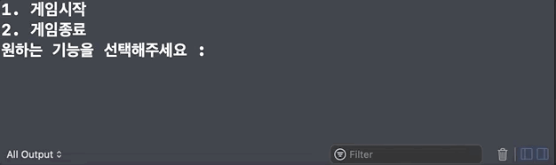
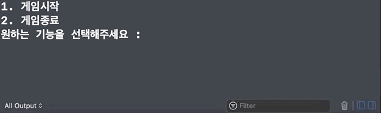

# 01 숫자 야구 게임
*[야곰 아카데미: iOS 커리어 스타터 캠프 2기]*
- 기간: 2021. 02. 23. ~ 2021. 02. 26.
- 내용: 중복되지 않는 1~9 사이의 숫자 세 개를 입력받아서 무작위로 생성된 정답과 비교하며 맞춰가는 간단한 게임
- 비고: 기간 내에 기능 구현은 모두 마쳤지만, 기능을 활용하여 게임을 진행하는 부분이 없어서 스크린샷을 찍기 위해 해당 부분을 추가함

## Screenshots 
### 잘못된 입력

### 컴퓨터의 승리

### 사용자의 승리

### 게임 종료


## 프로젝트 진행
- 프로젝트 경험이 없다 보니까 기초적인 커뮤니케이션도 힘든데 `git`으로 주고받아야 하다 보니 너무 복잡하고 힘들었다. 어디서 branch를 하고 어디로 merge를 하고 갈피를 잡는 것이 너무 어려웠고, log 잘못 써서 꼬이고, push 잘못해서 꼬이고 해서 너무 정신없었다. 😢  어떻게 `git`을 써야 지금처럼 더욱 복잡해지는 것이 아닌 더욱 효율적으로 팀워크를 높일 수 있는 것일까?

- guard를 정말 아무것도 모르고 쓰고 있다는 것을 깨달았는데, `if let`이나 `guard let`이나 `=`오른편에 옵셔널이 들어오고 `nil`이라면 `else`로 빠지는 것이었다. `guard let _userInput = userInput!.components(separatedBy: " ").map { Int($0)! } else { print(inputErrorMessage)}` 이 코드에서는 `map`을 통해 배열로 나뉘면서 옵셔널이 아니게 되므로 안 써졌던 것이다. 그래서 `userInput`을 `String`으로 우선 받고 따로 분리해주는 식으로 해결했다. 뭔가 애매할 때는 swift 공식 문서 보는 게 참 명확하고 좋은 듯하다! 🤓

- 옵셔널에 대해서 다시 보려고 야곰의 책을 펼쳐서 읽었는데, 매개변수의 타입이 옵셔널이라면 굳이 매개변수에 값이 없어도 되는 것이라는 의미가 생각해본 적이 없는데 아 그렇구나! 하고 깨달았다.

- 변수/함수 이름 짓기 참 어렵다!

- 나 자신이 안전하다고 생각하면 옵셔널 강제 언래핑이 괜찮다고 생각을 했지만 예측할 수 없는 경우가 생길 수도 
있으니 코드가 길어지는 것은 신경 쓰지 말고 안전하게 언래핑하자!

- 옵셔널에 대해서 강의를 들었는데, 특히 기억에 남는 것은 `nil`을 만났을 때 crash가 나는 이유에 대한 내용이다. `nil`에 해당하는 메모리 주소에는 할당되지 않은 정체 모를 값이 들어있을 수가 있는데 만약에 이게 다른 주소로 이동하는 명령어라면 운영체제는 바로 죽이게 되기 때문이다. 따라서 이 swift는 이것을 사용하지 않게 하려고 데이터를 `Optional`이라는 다리를 통해서 안전하게 설계한듯하다. 이후에는 프로젝트 리팩터링을 계속 진행했는데, 확실히 하면 할수록 코드에서 나는 악취가 보이기 시작하는 것 같아서 기분이 좋다.

## 프로젝트 회고

### 1-1. 네이밍에 대한 고찰

```swift
import Foundation

var randomAnswer = [Int]()
```

- randomAnswer 변수명이 불명확해 보임. 저거만 놓고 보면 랜덤한 대답이라는 의미이므로, 표현하고자 하는 뜻인 `컴퓨터가 만들어낸 임의의 수`를 표현하기 위해 `computerAnswers` 가 나을 듯?

```swift
func getResult(userInput: [Int], answer: [Int]) -> [Int] { }
```

- API 네이밍 가이드를 제대로 읽어보지 않아서 Swift에서의 메서드 명이 어떤 식으로 구성되는지 알지 못했다. 지금 상황에서 저 느낌 그대로 네이밍을 다시 해본다면 `computedResult(with userAnswer: [Int], and computerAnswer: [Int] -> [Int]`정도.. 그런데 저 자체가 기능의 분리가 잘 되어있지 않아서 이름을 주기가 애매하네! 이 당시에는 그게 잘 보이지 않았었나 보다.

```swift
if gameCount == 0 {
    print("컴퓨터 승리...!")
}
```

- `gameCount == 0` 이 컴퓨터의 승리 조건이라는 것을 기능 요구서를 본 사람만 알 수 있는 사실이기에, 나중에 다시 돌아와서 보면 알 수가 없다. 따라서 변수명을 `remainedChance`로 둬서 더 명확한 의미를 가지게 하거나, 저 조건문 자체를 `isComputerWin` 이라는 Bool 타입으로 둬서 관리하는 방법이 더 나을 듯...!

### 1-2. 무작위 수 생성 로직 중 중복되지 않는 임의의 수 표현

```swift
if result.contains(number) { continue }
result.append(number)
```

- 처음 만나는 `contains()`를 잘 활용한 로직이었는데 깔끔하게 잘 표현돼서 뿌듯했다 :)
- 근데 사실 `Set`을 쓰면 간단히 되는 것.. ㅎㅎ

---

### 2-1. 네이밍에 대한 고찰 2

```swift
func getIntArray(from: String?, separatedBy: String) -> [Int]? {
    guard let _from : String = from else { return nil }
    var result: [Int] = [Int]()
    
    for element in _from.components(separatedBy: separatedBy) {
        guard let integer = Int(element) else { return nil }
        result.append(integer)
    }
    
    return result
}
```

- argument label을 어떻게 사용하는지 몰라서 정말 읽기 어려운 코드를 만들어버렸다.
- 거기에 더해서 옵셔널 추출할 때 변수명 앞에 `_`를 붙이는 만행을 저지르다니..

### 2-2. 너무 깔끔해 보이려고 몰입해버림

```swift
switch userMenuInput {
    case 1: return true
    case 2: exit(0)
    default: return false
}
```

- 굳이 엔터를 안 누르고 이렇게 표현을 했는데, 지금 보니 그냥 평범하게 하는 게 더 깔끔한 듯!
